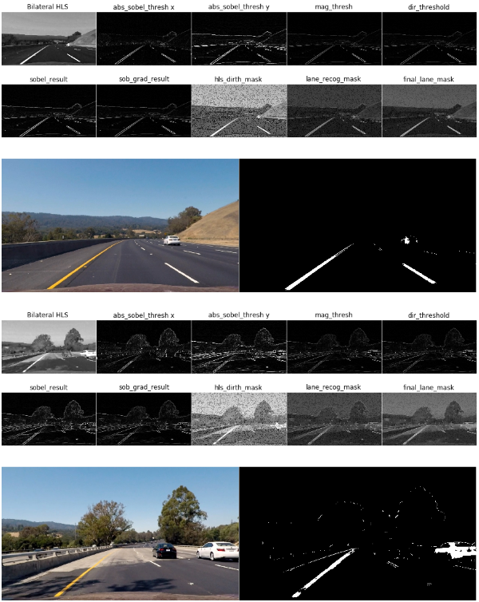
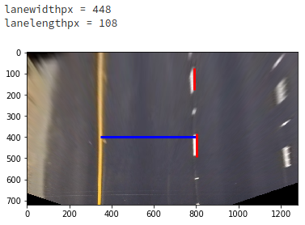

# **Advanced Lane Finding Project**

---

**Advanced Lane Finding Project**

The goals / steps of this project are the following:

1. Compute the camera calibration matrix and distortion coefficients given a set of chessboard images.
2. Apply a distortion correction to raw images.
3. Use color transforms, gradients, etc., to create a thresholded binary image.
4. Apply a perspective transform to rectify binary image ("birds-eye view").
5. Detect lane pixels and fit to find the lane boundary.
6. Determine the curvature of the lane and vehicle position with respect to center.
7. Warp the detected lane boundaries back onto the original image.
8. Output visual display of the lane boundaries and numerical estimation of lane curvature and vehicle position.

---

### Camera Calibration

The code for this step is contained in the IPython notebook in `01_02.Calibration_Undistortion.ipynb`.

Given the chessboard images, I start by preparing "object points", which will be the (x, y, z) coordinates of the chessboard corners in the world. Here I am assuming the chessboard is fixed on the (x, y) plane at z=0, such that the object points are the same for each calibration image.  Thus, `objp` is just a replicated array of coordinates, and `objpoints` will be appended with a copy of it every time I successfully detect all chessboard corners in a test image.  `imgpoints` will be appended with the (x, y) pixel position of each of the corners in the image plane with each successful chessboard detection.  


I then used the output `objpoints` and `imgpoints` to compute the camera calibration and distortion coefficients using the `cv2.calibrateCamera()` function.  I applied this distortion correction to the test image using the `cv2.undistort()` function and obtained this result:


Following is the sample images, when the calibration and undistorion was applied with test images.

For later use the calibrated camera parameters are saved

```python
ret, mtx, dist, rvecs, tvecs = cv2.calibrateCamera(objpoints, imgpoints, gray.shape[::-1],None,None)
camparam = {}
camparam['ret'] = ret
camparam['mtx'] = mtx
camparam['dist']= dist
camparam['rvecs']= rvecs
camparam['tvecs']= rvecs

if save :
    with open(picklePath, 'wb') as handle:
        pickle.dump(camparam, handle, protocol=pickle.HIGHEST_PROTOCOL)
```


### Pipeline (single images)

#### 1. Provide an example of a distortion-corrected image.

The code for this step is contained in the IPython notebook in `01_02.Calibration_Undistortion.ipynb`.

Given the camera calibration parameters, I applied this distortion correction to the test image using the `cv2.undistort()` function and obtained this result:

```python
with open('camparam.p', 'rb') as handle:
    camparam = pickle.load(handle)
```

```python
undist = cv2.undistort(img, camparam['mtx'], camparam['dist'], None, camparam['mtx'])
```

Following is an example of a distortion-corrected image.


(Left : original Right : undistorted)


#### 2. Describe how (and identify where in your code) you used color transforms, gradients or other methods to create a thresholded binary image.  Provide an example of a binary image result.

The code for this step is contained in the IPython notebook in `03_03.GenThresoldedBinaryImage.ipynb`.

I introduced `hls_denoised_lanefilter` function to apply some pre processing steps in HLS color space. The purpose was twofolds

1. to detect lane lines in different illumination condition.
2. to reduce edge detection chance in non-lane area of the image

For 1, I made weighted image sum of l channel and s channel.
Then For 2, applied `median` filter (initially started with `bilateralfilter` but choosen `median` due to it was computationally expensive and slow). The median filter preserved dominent edge well, while removing unnecessary details.


Then the denoised L+S merged image was used for edge detection.
As it was explained in the lecture, I've applied `abs_sobel` both on x and y direction, `mag_thresold`, `dir_thresold`.


Then I combined these edges as Following

1. ( sobel x + sobel y ) * 30% weight + ( mag thresolding ) * 70% weight
2. Overlay `dir thresolding` on denoised HLS
3. Merge 1 and 2 to get weighted lane pixels
4. Binarize the image given thresold.


This way, as shown above, I could collect only lane pixels under varying lighting condition.

Following is more example on lane pixel thresolding.




#### 3. Describe how (and identify where in your code) you performed a perspective transform and provide an example of a transformed image.

The code for this step is contained in the IPython notebook in `04_04.Rectification.ipynb`.

I have manually collected the points from the `straight_lines1.jpg`


| Source        | Destination   |
|:-------------:|:-------------:|
| 292,670       | 350,720       |
| 1013,670      | 800,720       |
| 527,500      | 350,450      |
| 765,500      | 800,450      |

The code for my perspective transform includes a function called `warp()`  The `warper()` function takes as inputs an image (`img`), as well as source (`src`) and destination (`dst`) points.  I chose the hardcode the source and destination points in the following manner:

```python
def warp(img, dpRslt=False) :
    img_size = (img.shape[1],img.shape[0])

    src_points = np.float32([[292,670],
                             [1013,670],
                             [527,500],
                             [765,500]])

    dst_points = np.float32([[350,720],
                             [800,720],
                             [350,450],
                             [800,450]])

    M = cv2.getPerspectiveTransform(src_points, dst_points)

    Minv = cv2.getPerspectiveTransform(dst_points, src_points)

    warped = cv2.warpPerspective(img, M, img_size, flags=cv2.INTER_LINEAR)

    if dpRslt :
        fig, axs = plt.subplots(1,2, figsize=(16, 11))
        fig.subplots_adjust(hspace = .1, wspace=.001)
        axs = axs.ravel()
        axs_set = [a.axis('off') for a in axs]    
        axs[0].imshow(img)
        axs[1].imshow(warped)

    # Return the binary image
    return warped
```

I verified that my perspective transform was working as expected by drawing the `src` and `dst` points onto a test image and its warped counterpart to verify that the lines appear parallel in the warped image.


#### 4. Describe how (and identify where in your code) you identified lane-line pixels and fit their positions with a polynomial?

The code for this step is contained in the IPython notebook in `05_06.LanePixel_Curvature.ipynb`.

Given the rectified image from the previous step, I have applied the sliding window method as explained in the lecture.

Following shows the sample histogram of peak given rectified lane image.


I've applied 9 slice of the image for peak detection, then collected white pixels within +/- 100 boundary from the x axis. ( For both the left and right). Given the collected left and right pixels, applied polyfit to get 2nd order polynomial coefficients.

Image below is the example of pixel collection and polynomial fit ( red : left / right : blue and yellow the fit )


#### 5. Describe how (and identify where in your code) you calculated the radius of curvature of the lane and the position of the vehicle with respect to center.

The code for this step is contained in the IPython notebook in `05_06.LanePixel_Curvature.ipynb`.

I have measured the distance between lanes and length of the dotted lane on a rectified image.

```python
plt.imshow(birdseye)
plt.hlines(400,349,797,color='blue',linewidth=3)
lanewidthpx = 797 - 349
plt.vlines(803,385,493,color='red',linewidth=3)
lanelengthpx = 493 - 385
plt.vlines(790,73,71+lanelengthpx,color='red',linewidth=3)
print ("lanewidthpx = {} \nlanelengthpx = {} \n".format(lanewidthpx,lanelengthpx))
```



Using above measured pixel distance and the knowledge that we know the distance between lanes are 3.7m and the length of each dotted lane is 3m we calculate meters in x axis and y axis.

```python
lanewidthpx = 448
lanelengthpx = 108
ym_per_pix = 3.0/lanelengthpx # meters per pixel in y dimension
xm_per_pix = 3.7/lanewidthpx # meters per pixel in x dimension
 :
# Calculate the new radii of curvature
left_curverad = ((1 + (2*left_fit_cr[0]*y_eval*ym_per_pix + left_fit_cr[1])**2)**1.5) / np.absolute(2*left_fit_cr[0])
right_curverad = ((1 + (2*right_fit_cr[0]*y_eval*ym_per_pix + right_fit_cr[1])**2)**1.5) / np.absolute(2*right_fit_cr[0])
```

After calculating the curvature in real world, I calculated car position as shown below

```python
left_fit_cr = np.polyfit(lefty*ym_per_pix, leftx*xm_per_pix, 2)
right_fit_cr = np.polyfit(righty*ym_per_pix, rightx*xm_per_pix, 2)
frame_center = binary_warped.shape[1]//2
height_idx = binary_warped.shape[0] - 10
lane_center = ( right_fitx[height_idx] - left_fitx[height_idx] ) //2 + left_fitx[height_idx]
dist_from_center = (lane_center - frame_center) * xm_per_pix
```


#### 6. Provide an example image of your result plotted back down onto the road such that the lane area is identified clearly.

The code for this step is contained in the IPython notebook in `07_08.RegionMaskingVideo.ipynb`.

I implemented this step in lines # through # in my code in `yet_another_file.py` in the function `map_lane()`.  Here is an example of my result on a test image:


---

### Pipeline (video)

#### 1. Provide a link to your final video output.  Your pipeline should perform reasonably well on the entire project video (wobbly lines are ok but no catastrophic failures that would cause the car to drive off the road!).

- project_video.mp4 processing result
Here's a [link to my video result](./output_videos/project_output.mp4)

- challenge_video.mp4 processing result
Here's a [link to my video result](./output_videos/challenge_output.mp4)


- harder_challenge_video.mp4 processing result
Here's a [link to my video result](./output_videos/harder_challenge_output.mp4)

---

### Discussion

#### 1. Briefly discuss any problems / issues you faced in your implementation of this project.  Where will your pipeline likely fail?  What could you do to make it more robust?

- Lighting condition and shadow.

As witnessed in with the `result in challenge video` and `harder_challenge_video`, applied approach suffers under different lighting condition and shadow. Although S channel can still be used as a valuable source to discriminate lane lines, we could think of dynamic and adaptive thresolding parameters.

- Denoising and decreasing details other than lane lines.

In the demonstrated approach I used median filter to reduce details other than lane lines. we could even go further for color based region segmentation to mask only the load regions. Then apply edge detection only to that load region.

- Inter frame relationship

I've applied the line fit model coming from the previous frame but there should be a mechanism that we do sliding window if the previous model misguide the detection. Due to the lack of time I haven't implemented the logic.

And many more
